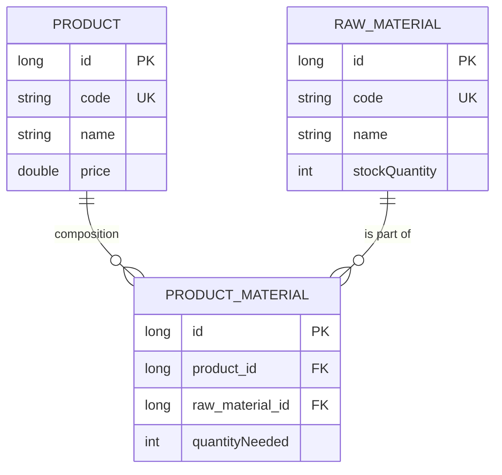

# Autoflex Challenge 🎯

A full-stack inventory and production management system designed to optimize manufacturing workflows.


---

## 📖 About the Project

Autoflex Challenge is a robust solution for tracking raw materials and calculating production potential. The system bridges the gap between stock availability and finished goods by managing complex Bills of Materials (BOM) and providing real-time production suggestions.

Developed with a focus on high performance and clean architecture, it ensures that production managers can identify exactly how many units of a product can be manufactured based on current inventory, preventing stockouts and optimizing yield.

---

## ✅ Key Features

*   **Inventory Management**: Full CRUD for Raw Materials with real-time stock tracking.
*   **Product Catalog**: Management of finished goods and their technical specifications.
*   **Dynamic BOM (Bill of Materials)**: Flexible association between products and the exact quantity of materials required.
*   **Production Yield Algorithm**: Intelligent suggestion engine that calculates maximum production capacity based on available stock and product market value.
*   **Global Notifications**: Centralized user feedback system for success, warning, and error states.
*   **Optimized Data Fetching**: Cached server state to minimize redundant API calls.

---

## 🛠️ Tech Stack & Architecture

### Backend (The Core)
*   **Java 21 / Quarkus**: Chosen for its native compilation capabilities and low memory footprint.
*   **Hibernate ORM with Panache**: Implements the **Active Record Pattern**, accelerating development without sacrificing database power.
*   **Oracle Database**: Enterprise-grade persistence for reliable data management.
*   **Hibernate Validator**: Ensuring data integrity via JSR-380 bean validation.

### Frontend (The Interface)
*   **React 19 / Vite**: Next-generation frontend tooling for a blazing-fast development experience.
*   **TanStack Query (React Query)**: Handles server-state management, caching, and automated re-fetching.
*   **Redux Toolkit**: Manages global UI state, such as theme preferences and notification queues.
*   **Material UI (MUI) 7**: Premium component library for a responsive, accessible, and modern design.

---

## 🏗️ Database Schema

The system follows a normalized relational structure to ensure data consistency across the supply chain.



---

## ⚙️ Getting Started

### Prerequisites
*   **Docker Desktop** (for Oracle DB)
*   **Java 21+** (JDK)
*   **Node.js v20+**
*   **Maven 3.9+**

### 🚀 Launching the Mission

1.  **Clone the repository**:
    ```bash
    git clone https://github.com/guilhermefaglioni/autoflex-challenge.git
    cd autoflex-challenge
    ```

2.  **Start the Database**:
    Use the provided Docker image for Oracle Free:
    ```bash
    docker run -d --name oracle-db -p 1521:1521 -e ORACLE_PASSWORD=admin container-registry.oracle.com/database/free:latest
    ```

3.  **Run the Backend**:
    Navigate to the api folder and start Quarkus in dev mode:
    ```bash
    cd inventory-api
    ./mvnw quarkus:dev
    ```
    *The API will be available at `http://localhost:8081`.*

4.  **Run the Frontend**:
    Open a new terminal, navigate to the web folder, install dependencies, and start:
    ```bash
    cd autoflex-web
    npm install
    npm run dev
    ```
    *The Web Dashboard will be available at `http://localhost:5173`.*

---

## 📄 API Documentation

The backend automatically exposes a **Swagger UI** for interactive API exploration. 
Once the server is running, access it at:

👉 [http://localhost:8081/q/swagger-ui](http://localhost:8081/q/swagger-ui)

---

## 🧪 Testing Strategy

### Backend 🛡️
Driven by **JUnit 5** and **REST Assured**, the backend features integration tests that validate the entire HTTP request lifecycle and database persistence.
```bash
cd inventory-api
./mvnw test
```

### Frontend 🧪
Powered by **Vitest** and **React Testing Library**, including **MSW (Mock Service Worker)** to intercept network requests and simulate API behaviors without hitting the real backend.
```bash
cd autoflex-web
npm test
```

---

Developed for the Autoflex Technical Challenge. 🚀
